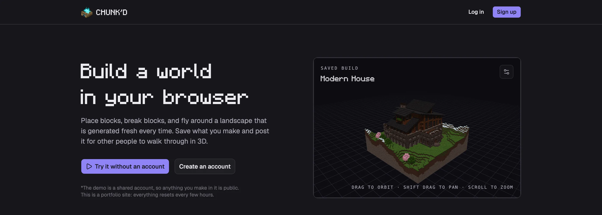

<h2 align="center">CHUNK'D</h2>

<p align="center">
Build voxel worlds in your browser, save them, and share them with other people.
</p>

## Description

A web app with two halves. The client is a React Three Fiber scene where you
walk around a generated landscape and place or break blocks, plus a social feed
where builds get posted and discussed. The server is a GraphQL API over MongoDB
that stores accounts, posts, comments, follows and saved worlds.



## Stack

| Layer | Choice |
|---|---|
| Package manager | pnpm workspaces |
| Client | React 19, Vite, Tailwind CSS v4, React Router |
| Interface | shadcn/ui on Radix primitives, Lucide icons |
| 3D | three.js, React Three Fiber, drei |
| Data | Apollo Client against a GraphQL API |
| Server | Express 5, Apollo Server 5, Mongoose, TypeScript run directly by Node |
| Database | MongoDB |
| Tooling | oxlint, Playwright, `node --test` |

Collision and terrain generation are written by hand rather than pulled from a
physics library. They live in `client/src/lib/voxel/` and are covered by tests.

## Installation

You need Node 22 or newer and pnpm.

```sh
pnpm install
cp .env.example .env      # then edit it, see below
pnpm db:up                # starts MongoDB in a container
pnpm seed                 # optional, fills the database with example content
pnpm dev                  # client on :3000, API on :3001
```

Open http://localhost:3000.

### The database

`pnpm db:up` runs `docker compose up -d`, which starts MongoDB 7 in a container
and stores its data in a named volume, so the data survives restarts.
`pnpm db:down` stops the container and leaves the volume in place.

Any Docker-compatible engine works, not just Docker Desktop. OrbStack and Colima
both provide the same `docker` command. Start the engine before running `db:up`.
With OrbStack that is `orb start`.

You do not have to run a container at all. The server connects to whatever
`MONGODB_URI` points at, so MongoDB installed through Homebrew or a hosted
MongoDB Atlas cluster works just as well. Skip `pnpm db:up` and set
`MONGODB_URI` to your own connection string.

### Environment

`.env` at the repository root configures the server. Copy `.env.example` and
fill it in. The only value with no sensible default is `JWT_SECRET`, which signs
login tokens. Generate one with:

```sh
node -e "console.log(require('crypto').randomBytes(48).toString('base64url'))"
```

The server validates its environment at startup and refuses to boot if anything
required is missing, so a misconfigured deployment fails immediately instead of
running in a broken state.

### Seeded accounts

`pnpm seed` creates 25 users, 66 posts and 6 saved worlds, so the feed, the
profiles and the 3D viewer all have something in them straight away. The
password below is for local development only; on the live site the seeded
accounts get a random one. The worlds
come from `server/src/seeders/showcaseBuilds.json`, which is generated by
`node scripts/generate-showcase-builds.mjs` against a running dev server and
committed, so seeding itself needs no browser. Every seeded account uses the
password `chunkd-dev-password`, and each one's email address is its username
followed by `@chunkd.test`.

## Scripts

Run these from the repository root.

| Command | What it does |
|---|---|
| `pnpm dev` | Runs the client and the API together |
| `pnpm build` | Builds the client for production |
| `pnpm start` | Runs the API, serving the built client in production mode |
| `pnpm seed` | Resets the database to example content. Does nothing if it is already in that state; `--force` resets anyway |
| `pnpm lint` | Lints the whole workspace with oxlint |
| `pnpm test` | Runs the unit tests |
| `pnpm typecheck` | Type-checks both packages |
| `pnpm test:e2e` | Drives a real browser through every route, needs `pnpm dev` running |
| `pnpm test:a11y` | Runs axe-core over every page and fails on any WCAG 2.1 A or AA violation, needs `pnpm dev` running |
| `pnpm test:prod` | Drives the critical path against a production build, see Deploying |
| `pnpm db:up` / `pnpm db:down` | Starts and stops the MongoDB container |
| `pnpm --filter server migrate:following` | One-off, renames the old `friends` field to `following` |

## Usage

Signed out, the front page explains what the app is and shows builds people
have made, rather than a feed of posts from strangers. Signing in replaces it
with the feed.

There is a demo account on the front page and on both auth pages, so the app
can be tried without signing up for anything. Everyone shares it, and it cannot change its
own username, email or password, because that would lock the next visitor out.
Everything else works: build a world, save it, post it, comment on other posts.

Signing in, signing up and the demo button are each limited per address on top
of the general request limit, and a query that is nested too deep or asks for
too many fields is refused before it runs. The reasoning behind all of this is
written up in [SECURITY.md](SECURITY.md).

Sign up to create an account. Once you are logged in you can read the feed,
open a build in 3D, comment on a post, and follow other users. The editor is
where you make a build of your own. Press P to name and save the world you are
standing in, then attach it to a post to share it.

### Controls

The editor needs a keyboard and a mouse or trackpad. Movement is WASD, aiming
uses the mouse, and the hotbar is on the number keys, none of which has a touch
equivalent yet. On a phone or a tablet with no trackpad the editor is left out
of the menu and its page explains why instead of loading. The rest of the site
works on any device, including turning a saved build around with a finger.

| Input | Action |
|---|---|
| W A S D | Move |
| Space | Jump |
| Double-tap space | Toggle flight |
| Shift | Walk slowly, or descend while flying |
| Mouse | Look, once you click to capture the pointer |
| Left click | Break a block. Hold to keep breaking |
| Right click | Place a block. Hold to keep placing |
| 1 to 9 | Choose a hotbar slot |
| Scroll wheel | Move along the hotbar, wrapping at both ends |
| R | Step the selected slot through whole block, slab and stairs |
| E | Open the block inventory |
| Shift and drag | Pan, when looking at a saved build |
| P | Name and save the current world |
| Esc | Release the mouse and pause |

The editor opens on a pause screen listing all of this. Clicking plays, Escape
comes back to it, and that screen is also where you leave the editor.

A jump clears a little over one block, so you can place a block under your own
feet and build upwards.

Anything half a block high or less is walked up rather than jumped onto, so a
slab floor, a terrace or a doorstep needs no jump. A whole block still does,
which is what keeps a wall a wall.

Holding either mouse button repeats the action about six times a second. On a
Mac trackpad this avoids the two-finger double tap that macOS reads as Smart
Zoom. If that gesture zooms the page, turn it off in System Settings, Trackpad,
Scroll & Zoom.

The hotbar holds nine blocks and there are far more than nine, so the inventory
is how you choose which nine. Picking a block there puts it into whichever slot
is currently selected.

Logs and hay bales have a grain and are placed along the face you build against.
A log put on top of something stands upright, and one put against a wall lies
down.

### Scenes and lighting

A saved build opens in a dark studio on a floor grid, which is what the rest of
the site looks like. The settings button in the corner of the viewer switches it
to the daylight sky the world was built under, turns the grid off, and changes
the lighting.

The editor has the same settings, on its pause screen. That matters more than it
sounds: a build's thumbnail is a capture of the editor's own render at the moment
you press P, so without them every thumbnail could only ever be a bright daylight
one. The editor and the viewer remember their choices separately, and both are
kept in the browser.

## Slabs

The blocks Minecraft gives slabs to can be laid as a slab, half a block tall,
filling either the lower or the upper half of its cell. Press R to switch the
selected hotbar slot between whole blocks and slabs; the slot remembers which,
so a block and its slab can sit side by side.

Which blocks those are is listed in `SLAB_BLOCK_IDS` in
`client/src/lib/voxel/blockIds.ts`, taken from the game rather than worked out
from our own textures: the stones, the worked stones and the planks, but not
logs, leaves, glass or the loose ground blocks. Cut sandstone has a slab and no
stairs, which is why there are two sets. Which half of the cell a slab fills is decided by where you
aim: on a top face it lies on it, under a bottom face it hangs from it, and
against a side the face splits down the middle, so aiming high gives a top slab
and aiming low a bottom one.

## Stairs

The same blocks take stairs, except cut sandstone, which has a slab in
Minecraft and no stairs. Press R twice to put a slot on stairs. Which half of
the cell they fill follows the same rule as slabs, so they can be hung upside
down for an arch or a sloped soffit, and the step faces the way you are looking
rather than the face you built against, so walking forwards goes up.

Two stairs meeting at right angles turn a corner, filling one quarter of the
cell on the outside of the turn and three on the inside. That shape is worked
out from the neighbours rather than stored, which is why a staircase tidies
itself up as you build and why breaking one leaves the rest correct.

Two slabs of the same block placed in one cell join into a whole block. Aiming
at the exposed half is what does it: from the side, a slab still places into
the cell next door.

Stairs collide as a whole cube. Exact per-shape collision was not worth it
here: a stair is a half block rise, so step assist walks you up it and the
difference is invisible in play.

## How the shapes are stored

A shape and a facing ride in the same number as the block's id and
orientation, in the bits above them, so they cost a saved build nothing:

```
  bits 13-14   bits 10-12   bits 8-9   bits 0-7
    facing        shape        axis        id
```

Everything defaults to zero, so a plain upright cube is still stored as exactly
its id and every build saved before any of this loads unchanged.

Across X and Z a cut block still fills its cell, so walls and doorways behave
as they always did. Height is the part that comes from the block: you stand on
a slab's own surface rather than on top of its cell, and a top slab is a
ceiling half a block lower than the cell it is in.

Faces are textured by the direction they point, worked out from the vertex
rather than from a table, which is what Minecraft does. A face pointing up gets
the top texture and a face pointing sideways gets the side texture, whatever
shape the block is, so a sandstone stair needs no special handling: stand level
with it and the risers read as one continuous side, look down and both treads
are top texture.

## How builds are saved

A saved build stores the world seed and the blocks you changed, not the world
itself. Loading one regenerates the terrain from the seed and reapplies your
changes on top. A save is therefore the size of what you did rather than the
size of the map, which is a few kilobytes instead of several hundred.

This makes terrain generation part of the save format. If `generateTerrain` ever
produces different output, every build saved before the change loads as a
different world, with no error to tell you. `format.test.ts` holds a hash of the
terrain for four fixed seeds to catch that. If it fails, either put the terrain
back the way it was, or raise `BUILD_FORMAT_VERSION` and keep the old generator
for old builds.

The format is at version 3, which added slabs. Version 2 builds are still read,
because they are exactly readable: no shape bits means every block is a whole
cube, which is what a version 2 build is. `READABLE_VERSIONS` in `format.ts` is
the list, kept explicit so that accepting an old version stays a decision
rather than something that happens by default.

## Deploying

In production the API also serves the built client, so this deploys as one
service rather than a separate frontend and backend. `railway.json` pins the
build and start commands and points Railway's healthcheck at `/health`, so a
deploy does not depend on what the platform infers.

Add a MongoDB, either Railway's template or a MongoDB Atlas cluster, then set
these variables on the service:

| Variable | Value |
|---|---|
| `NODE_ENV` | `production` |
| `MONGODB_URI` | a reference to the database service, or an Atlas connection string |
| `JWT_SECRET` | a generated value of at least 32 characters |
| `CLIENT_ORIGIN` | the service's own public URL |

`PORT` is supplied by the platform and read automatically.

The server refuses to boot if `JWT_SECRET` is still the placeholder from
`.env.example`, or if it can see it is running on Railway without
`NODE_ENV=production`, because that one missing variable would switch off the
content security policy, open CORS to any origin and put stack traces in
error responses all at once.

### The scheduled reset

This is a portfolio site, so the database is wiped and rebuilt from the
showcase builds on a schedule. Anything anyone posts through the demo account
lasts until the next reset. That is the whole moderation strategy, and it is
why there is nothing worth backing up: `showcaseBuilds.json` in git is the
canonical state.

Add a second Railway service from the same repository:

```
Cron schedule:  0 */6 * * *
Config file:    railway.reset.json
Variables:      MONGODB_URI, NODE_ENV=production, SEED_ALLOW_PRODUCTION=1
```

Point that service's config file at `railway.reset.json` rather than leaving it
on the default. Both services are built from the same repository, so without
this the reset service reads `railway.json` and inherits the API's start
command and healthcheck: it would run the API instead of the seeder, never
exit, and the schedule would do nothing. `railway.reset.json` sets the start
command to the seeder, skips the client build the reset does not need, and
turns off restart-on-failure so a failed run waits for the next schedule
instead of retrying in a loop.

Set `SEED_ALLOW_PRODUCTION=1` on the reset service only, never on the API
service. Without it the seeder refuses to touch a production database, which
is what protects you from running it by hand with the wrong `.env` loaded.

The seeder leaves the database alone when nobody has used it since the last
reset, keeps the demo account's row so tokens issued before a reset still work
after it, and on the live site gives the seeded accounts a random password so
nobody can sign in as one of the showcase authors.

Check the production path locally before deploying. Development and production
differ in ways the ordinary test suite cannot see, so there is a suite for this:

```sh
pnpm build
NODE_ENV=production PORT=4000 pnpm start
pnpm test:prod                     # in another terminal
```

It signs up, builds and saves a world, posts it, opens the post in 3D and
comments, and fails on any console error. The same command checks a real
deployment:

```sh
BASE=https://your-app.up.railway.app pnpm test:prod
```

Four things catch people out on a first deploy.

`NODE_ENV` must be exactly `production`. Anything else and the server skips
serving the client, so every page returns 404 while `/graphql` keeps working.

A `JWT_SECRET` shorter than 32 characters fails validation and the process exits
during startup. That is deliberate, but it looks like a crash loop.

The build needs devDependencies, because Vite lives there. Do not enable an
install flag that skips them.

A Content-Security-Policy applies in production and not in development, so a
page can work locally and break once deployed. `pnpm test:prod` is what catches
that. If you add a library that loads WebAssembly or fetches from another
origin, expect to widen the policy in `server/src/server.ts`, and to think about
whether the dependency is worth it first.

The server has no build step. Node runs its TypeScript sources directly, which
is why `.node-version` matters. It must stay at 22.18 or newer.

## Block textures

The blocks use [Faithful 32x](https://faithfulpack.net/faithful32x), under the
[Faithful licence](https://faithfulpack.net/license) version 4, which permits
using and distributing their work in your own games provided you credit them
clearly and link back. That credit is in the site footer and in the in-game
controls panel. Full detail, including the five textures that are tinted copies
rather than exact ones, is in
[`client/src/assets/textures/CREDITS.md`](client/src/assets/textures/CREDITS.md).

Because the file names are Minecraft's own, any Minecraft resource pack can
stand in. Put its block images in `client/public/texturepack/` and add this to
`client/.env.local`:

```
VITE_TEXTURE_PACK=/texturepack
```

Each block prefers the pack's image and falls back to the bundled one, so a
partial pack works. That directory is ignored by git, which matters for packs
whose licences forbid redistribution, such as Sphax PureBDCraft and Ashen 16x.
They can be used locally this way but must never be committed.

## Layout

```
client/    React app. Vite, Tailwind, and the 3D editor.
server/    GraphQL API. TypeScript, run directly by Node with no build step.
e2e/       Browser smoke test covering every route, plus an accessibility audit.
```

## Styling

Every colour, radius and font on the site comes from tokens at the top of
`client/src/index.css`. Change a hex value in the `:root` block and the whole
site follows.

## Credits

Built and maintained by Adrian Jimenez. The 2026 rebuild is his work: the voxel
editor and its renderer, the save format, the GraphQL API and the interface.

The original 2022 version was a team project with Alexander Havers, Caleb
Funderburk, Austin Reed and Dane Cronin. None of that interface remains.

Block textures are [Faithful 32x](https://faithfulpack.net/faithful32x), used
under the [Faithful licence](https://faithfulpack.net/license), with the exact
files and any edits listed in
[client/src/assets/textures/CREDITS.md](client/src/assets/textures/CREDITS.md).
The 3D editor started from [this sandbox](https://codesandbox.io/s/vkgi6).

Not an official Minecraft product. Not approved by or associated with Mojang.

## License

MIT. See [LICENSE](LICENSE).
