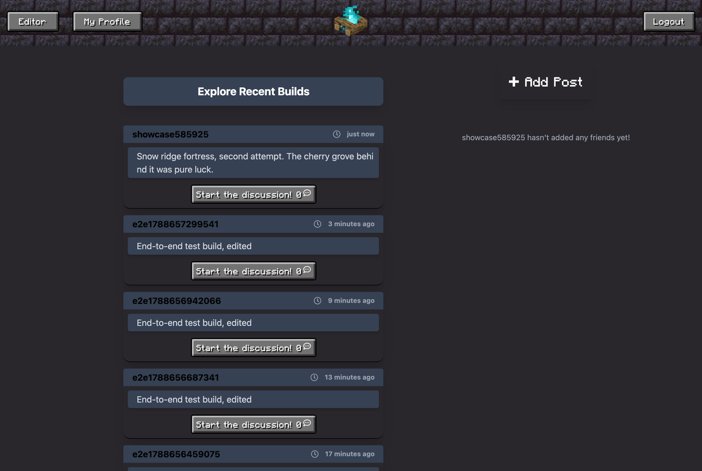
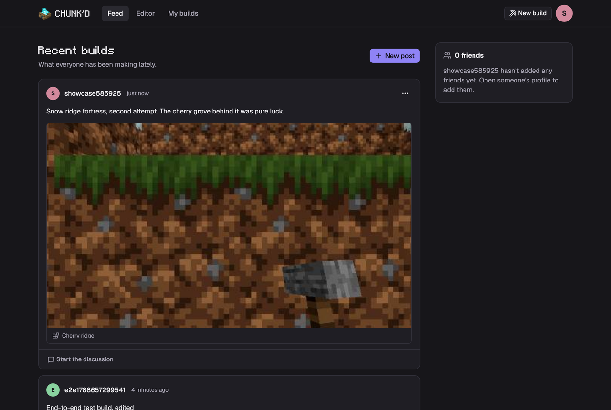
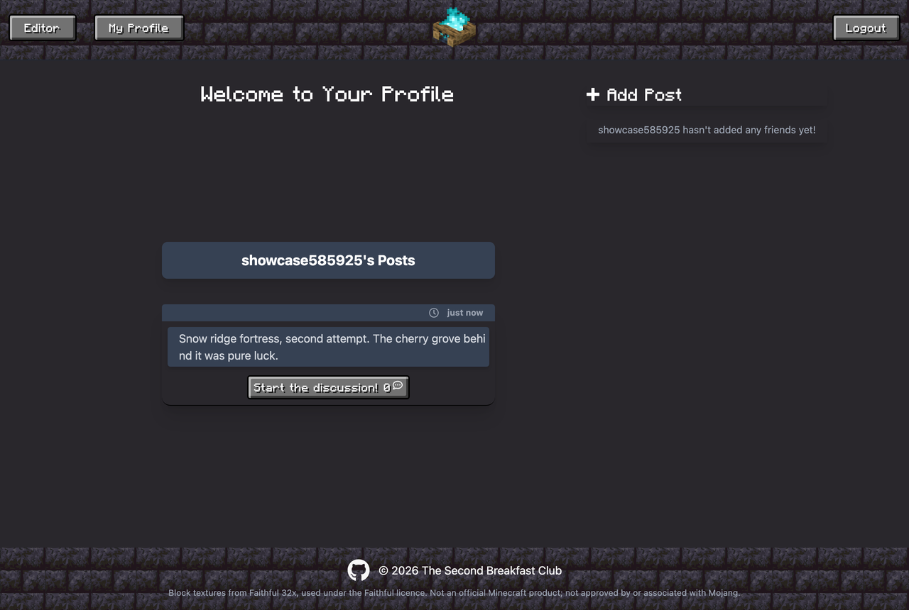
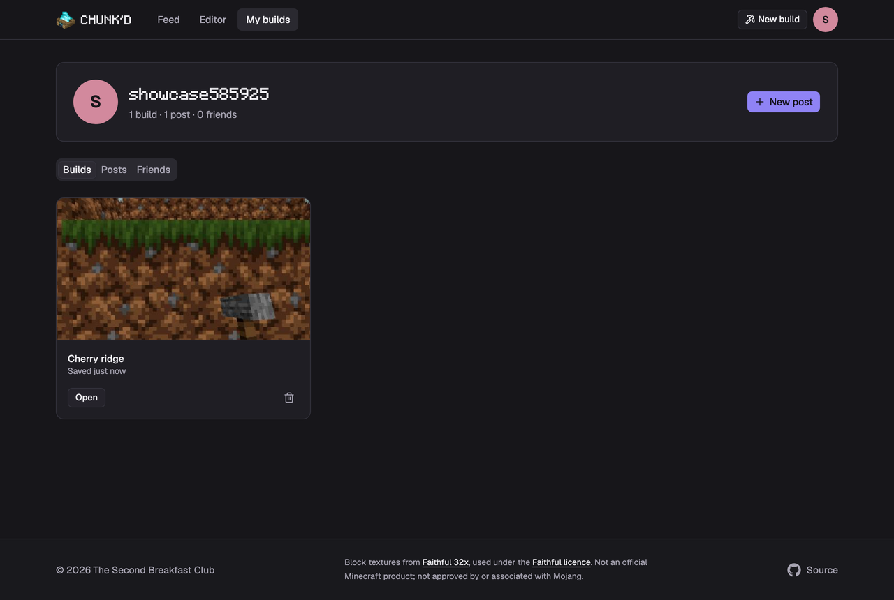
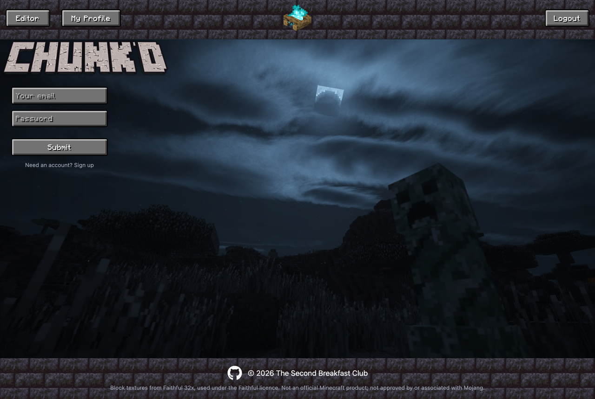
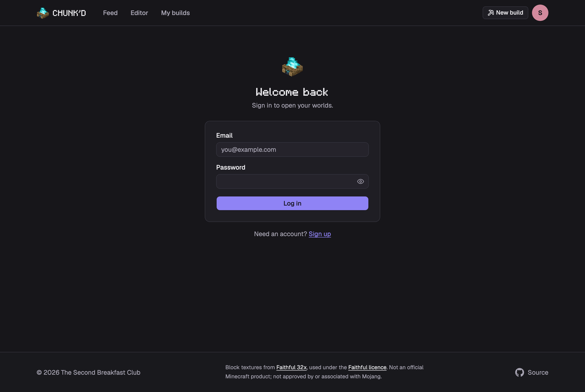
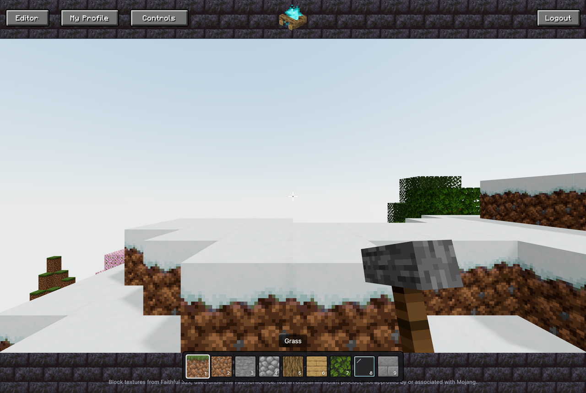
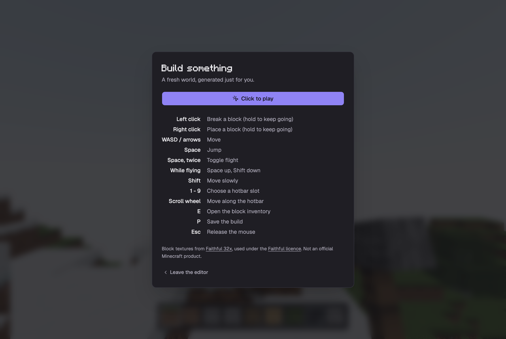

# Phase 6: the redesign

Before and after, same account and same data in both. The "before" column is
commit `62248c0`, the last one before this phase.

| Page | Before | After |
|---|---|---|
| Feed |  |  |
| Profile |  |  |
| Log in |  |  |
| Editor |  |  |

## How the styling is organised

Everything visual comes from tokens in `client/src/index.css`. There are two
layers there and the split is the thing worth understanding:

- `:root` holds the raw colours, one per role, as plain hex. Change a value
  here and the whole site follows.
- `@theme inline` gives each of those roles a Tailwind name, so `--card`
  becomes the `bg-card` and `text-card` utilities.

shadcn/ui's components are written against those role names, which is why a
component copied in from the registry picks up this palette without being
edited. `pnpm dlx shadcn@latest add <name>` inside `client/` drops a new one
into `client/src/components/ui/`.

The site is dark only. A light theme would be a second design to maintain, and
the 3D view is lit for a dark surround. Every text colour was checked against
the surface it sits on; the dimmest pairing, muted text on a card, is 6.8:1
against a 4.5:1 requirement.

Two fonts. Geist carries the body text. The pixel font is a separate token,
`--font-display`, used for the wordmark and page titles only, because it is
charming in short bursts and unreadable in paragraphs.

## Measured

Lighthouse against the production build, `client/dist` served statically:

| Category | Score |
|---|---|
| Performance | 93 |
| Accessibility | 100 |
| Best practices | 100 |
| SEO | 100 |

`pnpm test:a11y` runs axe-core over the feed, profile, login, signup, 404 and
the editor's pause screen and reports no WCAG 2.1 A or AA violations. It needs
the app running.

One caveat on the performance number: the static server does not proxy
`/graphql`, so the feed had no posts to draw. A full feed with build thumbnails
will score somewhat lower.

## Things this phase changed on purpose

- **The editor left the site shell.** It is a full-window pointer-locked view,
  and while it shared the shell the hotbar was drawn over the footer and the
  sticky header ate the top of the canvas. It is now its own route outside the
  layout, with its own pause screen carrying the controls and the way out.
- **Builds can be named.** Pressing P used to save immediately as "Untitled
  build". It now captures the world and the current view, then asks for a name,
  so the thumbnail shows the shot the player framed rather than wherever the
  camera drifted while they typed.
- **Pinch to zoom came back.** The viewport tag carried `user-scalable=no` to
  stop Safari zooming on a double tap in the editor. That tag applies to the
  whole site, so it also stopped anyone enlarging a post to read it, which axe
  reports as a WCAG 1.4.4 failure. The double tap is handled without it:
  `touch-action: manipulation` drops that gesture while keeping pinch, and the
  editor separately refuses ctrl+wheel and Safari's gesture events.

## Mutations that finally have a user interface

These existed on the API from the start and were never reachable. Each one is
covered by the end-to-end suite.

| Mutation | Where it lives now |
|---|---|
| `updateThought` | Edit in place, from a post's actions menu |
| `deleteThought` | Same menu, behind a confirmation |
| `deleteBuild` | The build gallery on your own profile |
| `deleteReaction` | A delete button on your own comments |
